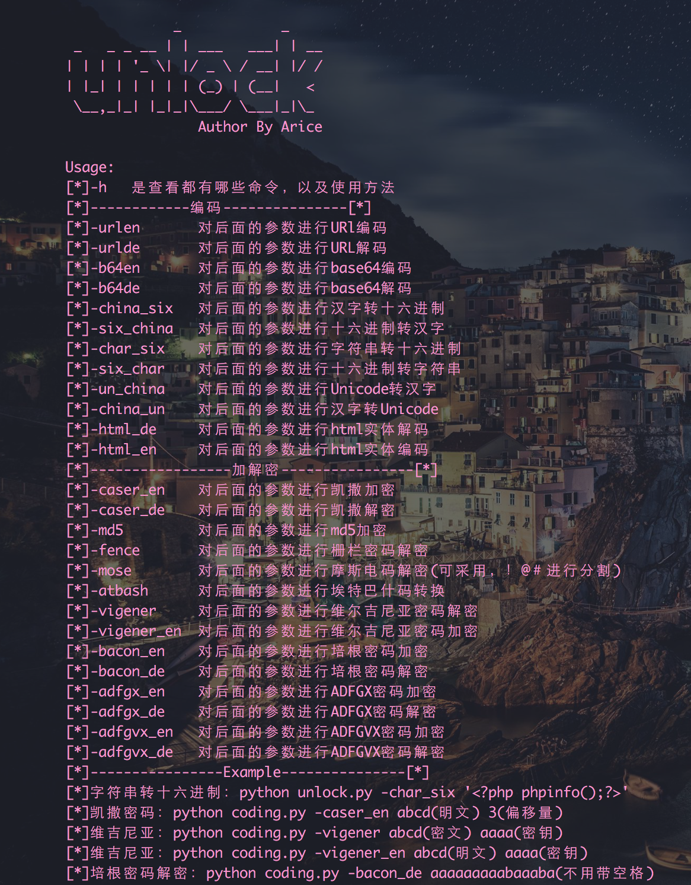

## 目的
* 有时候不方便上网进行操作，也不想用界面版的工具，想在终端上完成尽可能多的操作。使用终端、更快捷的解决一些编码解码和一些简单的加密解密的问题
***
## 环境
* python2.7
* 需要有pycipher、termcolor、cgi、binascii、urllib等模块，在源代码中都能看到，pip安装即可
***
## 用法
* 使用-h参数可以查看使用方法，以及一些命令

